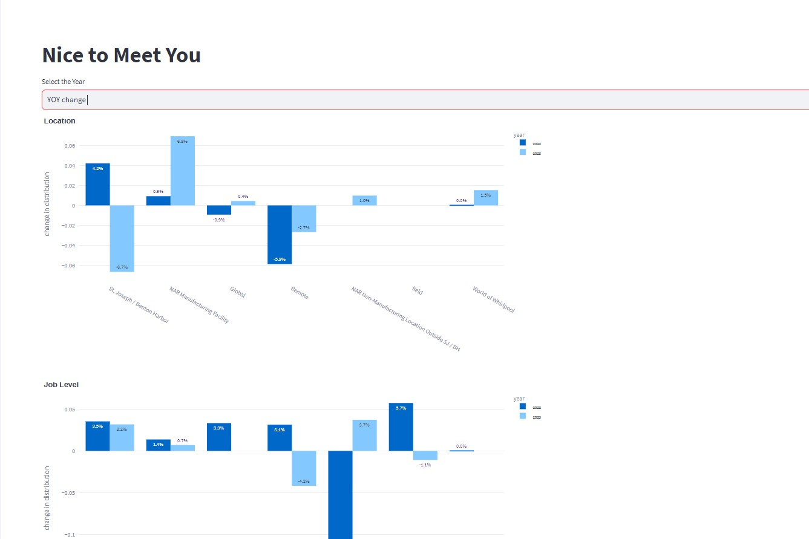

# VOM-Dashboard
Interactive dashboard to view Voice of Membership Annual Survey Results




Welcome to the VOM-Dashboard Repository! This repository contains all the code and resources you need to create a dynamic and interactive dashboard for your data visualization needs. Whether you're a data analyst, business professional, or developer, this dashboard will help you make sense of your data and present it in a compelling and informative way.

## Features

- Interactive charts and graphs: Visualize data with interactive charts and graphs that allow users to explore the data.
- Customizable widgets: Add and arrange widgets to create a personalized dashboard layout tailored to your needs.
- Data integration: Easily connect to data sources. 

## Getting Started

To get started with this interactive dashboard, follow these steps:

1. **Clone the Repository**: Clone this repository to your local machine using the following command:

   ```bash
   git clone https://github.com/wuq2-whirlpool/VOM-Dashboard.git
   ```

2. **Install Dependencies**: Make sure you have the necessary dependencies installed. Check the `requirements.txt` file for Python packages and any frontend dependencies specified.

3. **Run the Dashboard**: Start the dashboard application by running the main script. This could be something like:

   ```bash
   streamlit run code/Hello.py
   ```

6. **Access the Dashboard**: Open your web browser and navigate to `https://whirlpool-vom-dashboard.streamlit.app/
`to access the dashboard. 

## Folder Structure

The repository is organized as follows:
- `code/`:  Directory to store the code scripts.
- `code/Hello.py`: The main script to run the dashboard application.
- `data/`: Directory to store historical survey responses. Please save each year's response separately.
- `config/`: Configuration files for dashboard access.
- `img/`: Directory to store images.  

## Dependencies

- `Python 3.9`
- `Streamlit 1.24`


## Contact

If you have any questions, suggestions, or issues, please feel free to contact me at qiqi_wu@whirlpool.com

Happy data visualizing! 📊🚀
